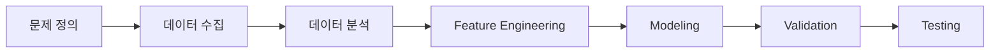

## Flow

```mermaid
flowchart LR
    A[문제 정의] --> B[데이터 수집];
    B --> C[데이터 분석];
    C --> D[Feature Engineering];
    D --> E[Modeling];
    E --> F[Validation];
    F --> G[Testing];
```

### Feature Engineering
- 데이터를 분석한 내용과 도메인 지식을 바탕으로 feature vector(컴퓨터가 알 수 있는 숫자)로 만들어 주는 작업

### Validation
- Cross Validataion : 데이터셋을 나눠서 일부분은 테스트, 일부분은 학습용 데이터로 사용해서 모델의 정확도를 검증하는 방법